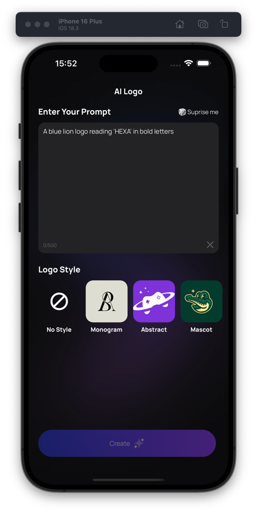
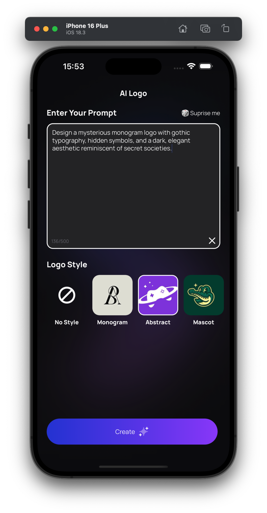
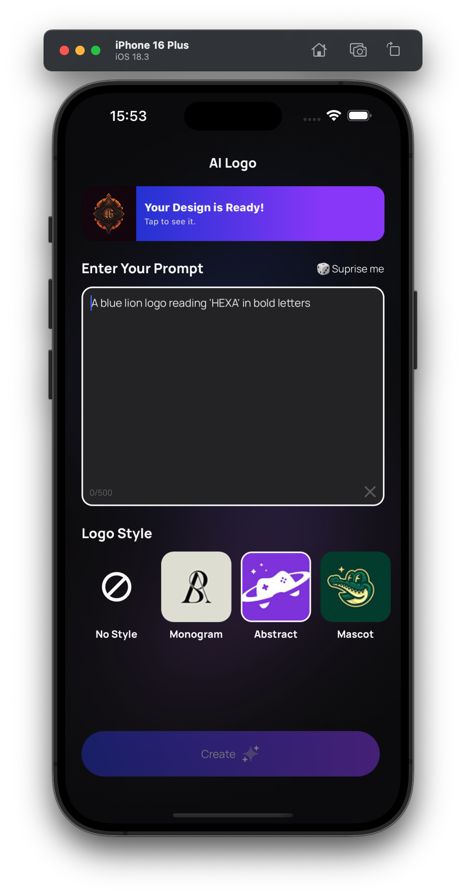
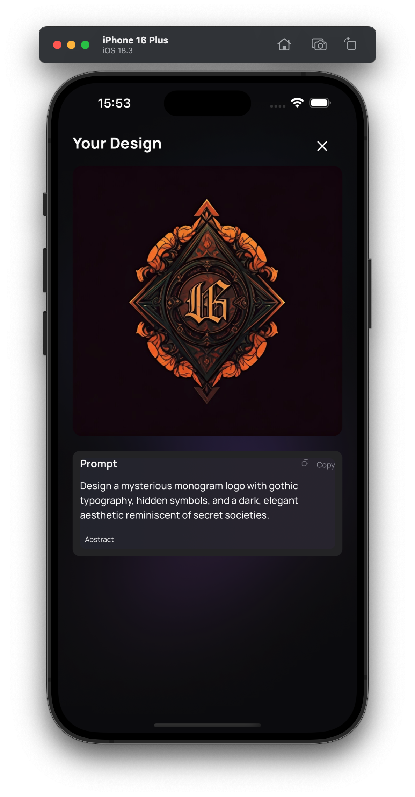

# AI Logo Generator

|                                                        |                                                         |                                                        |                                                         |
| ------------------------------------------------------ | ------------------------------------------------------- | ------------------------------------------------------ | ------------------------------------------------------- |
|  |  |  |  |

## Features

1. AI-Powered Logo Creation: Generate professional logos using Google Vertex AI's Imagen model
2. Multiple Design Styles: Choose from various logo styles including Monogram, Abstract, and more
3. Text Prompt Interface: Describe your logo idea or use "Surprise Me" for random suggestions
4. Real-time Status Updates: Track the progress of your logo generation
5. Copy & Share: Copy prompts and share your generated logos

## Technology Stack

- Frontend: React Native, Expo
- Styling: NativeWind (Tailwind CSS for React Native)
- State Management: Zustand
- Storage: Firebase Storage
- Database: Firestore
- AI Integration: Google Vertex AI (Imagen 3.0)
- API: Firebase Cloud Functions

## Prerequisites

Before you begin, ensure you have the following installed:

- Node.js (v16 or higher)
- npm or yarn (I recommend using yarn)
- Expo CLI & EAS
- Firebase project with Firestore, Storage, and Authentication enabled
- Google Cloud project with Vertex AI API enabled
- Installation
- Clone the repository

### Steps:

1. Create a Firebase project
2. Add iOS and Android apps to your Firebase project
3. Download the configuration files:
   - GoogleService-Info.plist for iOS
   - google-services.json for Android
4. Place these files in the project root directory and EAS environment variables
5. Start the development server
   - The project cannot be run using Expo Go, so you need to build the app using EAS or development build('Cuz of native Firebase integration for analytics and crashlytics)

```bash
yarn
yarn expo run:ios # or
yarn expo run:android
```

After the build is complete, you can run the app on your device or emulator no need additional setup for iOS and Android, just run the command below:

```bash
yarn start
#press 'i' to run on iOS simulator
#press 'a' to run on Android emulator
```

## How It Works

1. Create a Prompt: Enter a description for your desired logo
2. Select a Style: Choose from available logo styles (or no style)
3. Generate: The app sends your request to Firebase Cloud Functions
4. AI Processing: The function uses Google Vertex AI to generate a logo based on your prompt and selected style
5. Receive Result: The generated logo is stored in Firebase Storage and displayed in the app

## Project Structure

- **/app**: Main application screens using file-based routing
- **/components**: Reusable UI components
- **/functions**: Firebase Cloud Functions for handling API requests
- **/hooks**: Custom React hooks for API calls
- **/stores**: Zustand stores for global state management
- **/constants**: Application constants and configuration
- **/utils**: Utility functions some generic functions for the app
- **/assets**: Images and icons used in the app

## Using the Firebase Functions

The project uses Firebase Cloud Functions to interface with Google Vertex AI:

- Navigate to the functions directory

```bash
cd functions
```

- Install dependencies

```bash
yarn install
```

- Set up Firebase CLI

```bash
npm install -g firebase-tools
firebase login
firebase init functions
```

- Deploy the functions to Firebase

```bash
firebase deploy --only functions:startGeneration
```

## Troubleshooting

- Common Issues
  Firebase Connection Issues: Ensure your Firebase configuration files are correctly placed in the project root.
- Image Generation Failures: Check that your Google Cloud project has the Vertex AI API enabled and proper billing set up.
- Build Errors: Make sure all dependencies are installed and compatible versions are used.

## Contributing

Contributions are welcome! Please feel free to submit a Pull Request.

- Fork the repository
- Create your feature branch (git checkout -b feature/amazing-feature)
- Commit your changes (git commit -m 'Add some amazing feature')
- Push to the branch (git push origin feature/amazing-feature)
- Open a Pull Request

## License

This project is licensed under the MIT License - see the LICENSE file for details.

## Acknowledgments

Google Vertex AI for the image generation capabilities

Expo team for the excellent React Native development platform

Firebase for backend services
